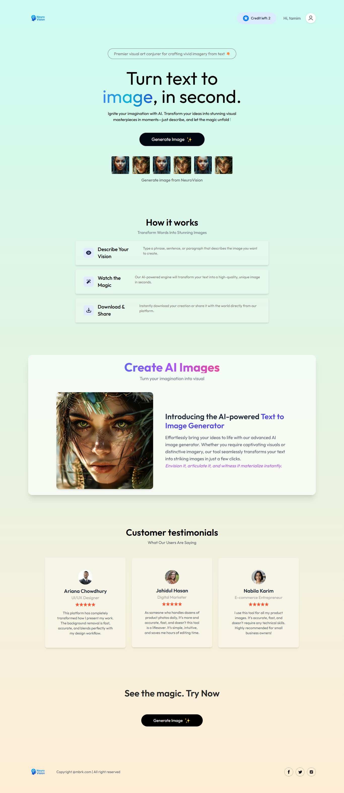
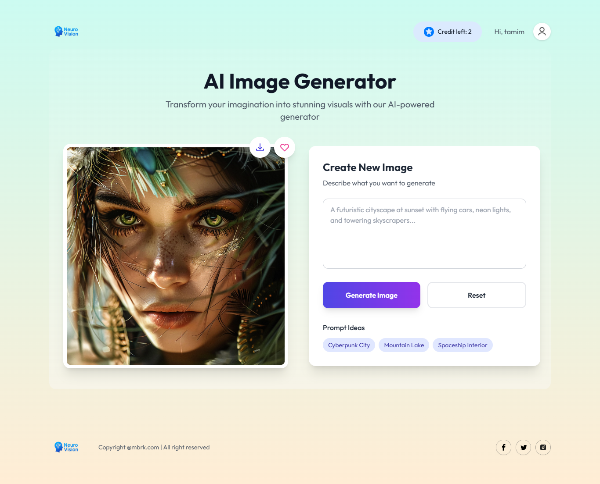
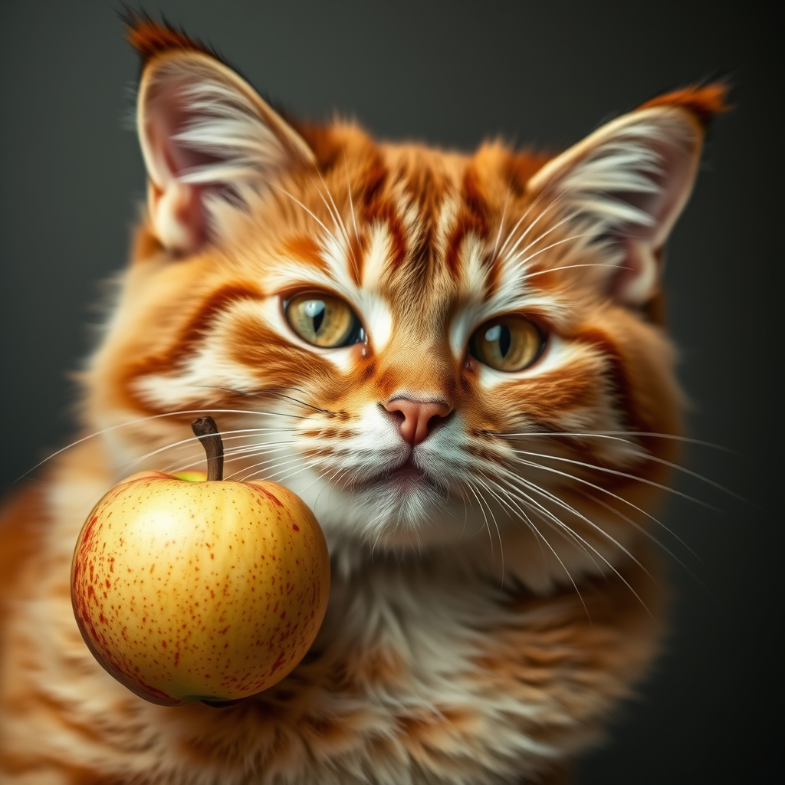
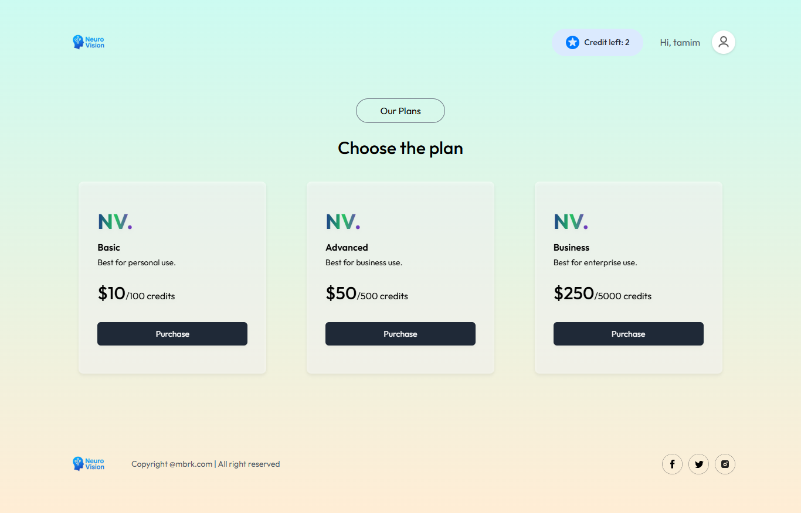
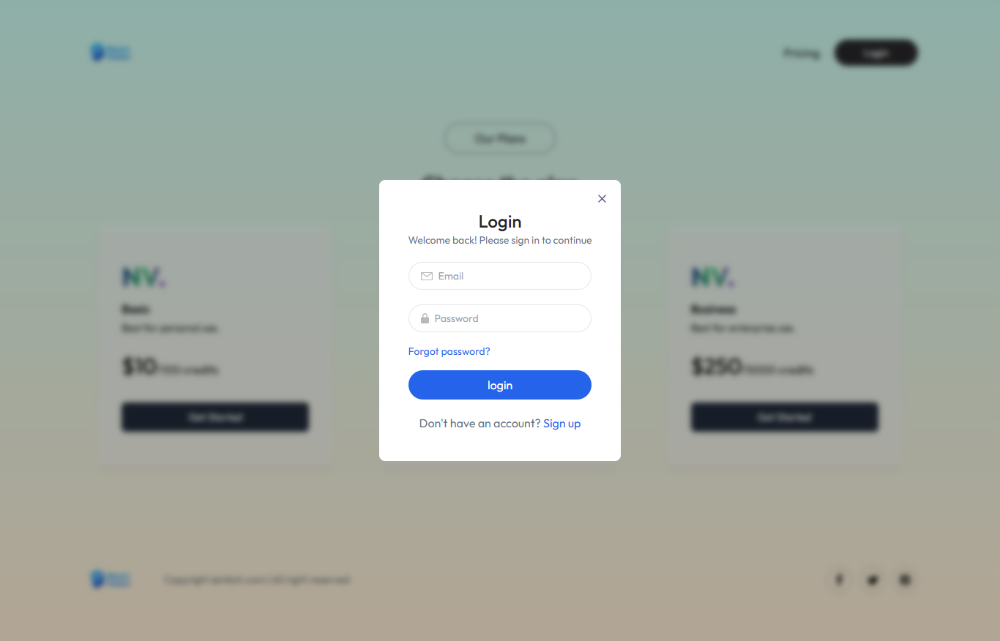

# 🧠 Neuro Vision - AI-Powered Text-to-Image Generator

[](https://reactjs.org/)
[](https://nodejs.org/)
[](https://opensource.org/licenses/MIT)

Neuro Vision transforms textual descriptions into stunning visual art using advanced AI technology. Built with a modern tech stack, this application provides a seamless experience for generating, customizing, and downloading AI-generated images.


## ✨ Key Features

- **AI-Powered Image Generation**
  - Convert text prompts to high-resolution images
  - Multiple style and composition options
  - Real-time generation progress tracking

- **Image Management**
  - Multi-format download options (PNG, JPG, WebP)
  - Image regeneration with modified prompts
  - Visual history of generated images

- **User Experience**
  - Credit-based usage system
  - Intuitive prompt suggestions
  - Responsive design for all devices
  - Loading animations and visual feedback

- **Security & Management**
  - JWT-based authentication
  - User profile management
  - Subscription plans with credit systems
  - Usage analytics dashboard

## 🖼️ Application Screens

| Feature               | Preview                                                                 |
|-----------------------|-------------------------------------------------------------------------|
| **Home Page**         |                               |
| **Image Generation**  |                |
| **Result Display**    |                |
| **Generated  Images**  |                       |
| **Generated  Images**  | .png)                      |
| **Generated  Images**  | .png)                      |   
| **Subscription Plans**|                          |
| **User Authentication** |                          |

## 🛠️ Technology Stack

### Frontend
- **Framework**: React
- **Styling**: Tailwind CSS
- **Animation**: Framer Motion
- **State Management**: React Context API
- **HTTP Client**: Axios
- **Notifications**: React Toastify

### Backend
- **Runtime**: Node.js
- **Framework**: Express.js
- **Database**: MongoDB with Mongoose ODM
- **Authentication**: JWT with bcrypt.js
- **API Security**:  CORS

### Development Tools
- **Package Manager**: npm
- **Linting**: ESLint + Prettier
- **Build Tool**: Vite
- **Version Control**: Git
- **CI/CD**: GitHub Actions

## 🚀 Getting Started

### Prerequisites
- Node.js 
- npm
- MongoDB Atlas account or local MongoDB instance

### Installation

1. Clone the repository:
```bash
git clone https://github.com/your-username/neuro-vision.git
cd neuro-vision
